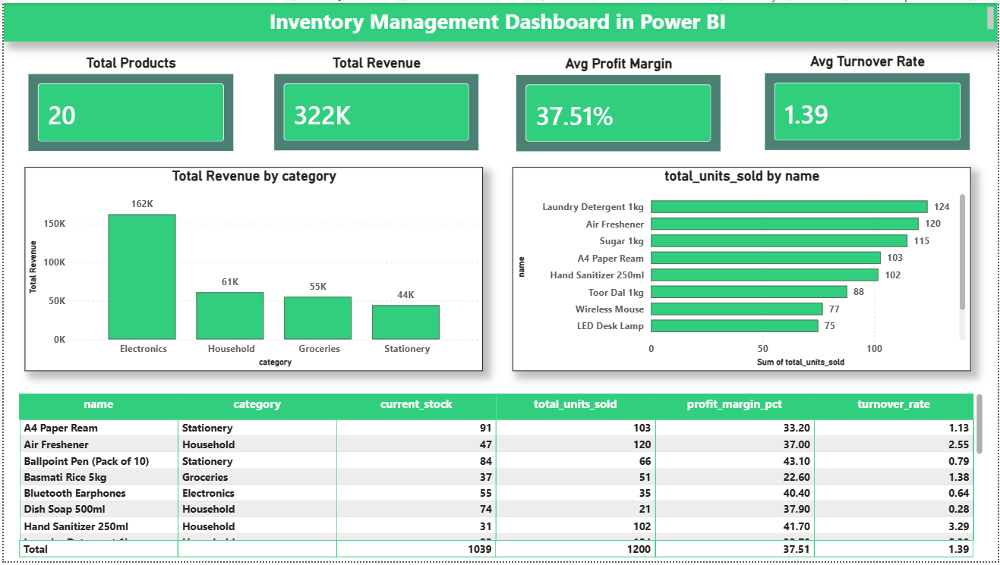

# Inventory Management System — Sales & Stock Analysis

## Problem Statement

Retail businesses need to know which products drive revenue, which are profitable, 
and which are sitting as dead stock — without this insight, businesses overstock 
slow-movers and understock best-sellers. This project extends a Python + SQLite 
inventory management system with SQL-based analytics to identify best-selling products, 
profit margins, category performance, and stock turnover efficiency.

## Dataset

The system manages three relational tables: **products** (current stock and price), 
**sales** (transaction history), and **purchases** (restocking history). Since the 
original test data was minimal, realistic sample data was generated (`seed_data.py`) 
representing 20 general retail products across Electronics, Groceries, Household, and 
Stationery categories, with 350 sales and 104 purchase records spread across 180 days — 
enough volume to reveal meaningful sales patterns.

## Analysis Approach

All analysis (`sales_analysis.py`) was built using SQL queries joining the products, 
sales, and purchases tables — not just Pandas — to calculate:
- **Best-selling and slow-moving products** (by total units sold)
- **Profit margin per product** (average sale price vs. average purchase cost)
- **Revenue by category**
- **Stock turnover rate** (units sold ÷ current stock — a standard inventory efficiency metric)

Results were exported (`export_analysis.py`) into a Power BI-ready CSV for dashboarding.

## Key Findings

**Electronics drives the most revenue** (₹161,885) despite having fewer product lines 
than Groceries or Household — high per-unit value outweighs lower sales volume.

**Profit margin doesn't align with sales volume.** The highest-margin product 
(USB-C Cable, 56.6%) was also one of the slowest movers, while several high-volume 
sellers (e.g., Sugar, Toor Dal) carry the thinnest margins (~22-28%) — suggesting 
volume and profitability need to be optimized together, not treated as the same goal.

**Stock turnover varies significantly** — Laundry Detergent turns over 5.4x while 
several products sit below 1.0, indicating overstocking risk on slower-moving items.

## Dashboard

An interactive Power BI dashboard visualizes total products, revenue, profit margin, 
and turnover rate at a glance, alongside category revenue breakdown, top-10 best 
sellers, and a full filterable product table.

## Tech Stack

- **Database:** SQLite
- **Data Analysis:** Python (Pandas), SQL (joins, aggregations)
- **Visualization:** Power BI (DAX measures, KPI cards, charts)
- **Core App:** Python CLI (product/stock/sales/purchase management)

## What I'd Improve Next

- Track low-stock alert frequency over time (currently only checks current state)
- Add a slow-mover/dead-stock alert view to the dashboard
- Model reorder point recommendations based on turnover rate and lead time
- Connect real point-of-sale data instead of generated sample data